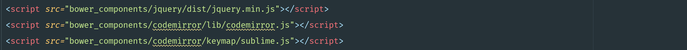

### CodeMirror 初始集成版

CodeMirror是基于JS写得一款插件，其功能强大，易于拓展，笔者在官方文档及其[others' help](http://www.hyjiacan.com/codemirror-config/)的帮助下将编辑器融入一个demo中，大家可任意进行拆解。

> 👇来说一下基本步骤

#### A.step

首先你要确保先有`CodeMirror`的库，可以从官网进行下载，如果zip不幸挂掉了，可以`git clone 项目地址`，或者通过其他仓库进行安装。

#### B.step

页面中先引入


一个主样式文件是必须的，第二个是theme主题文件，可自选。然后再引入必须的js文件，笔者键位绑定的`sublime`，codemirror也给使用者提供了另外两种
`vim`,`emacs`，怎么方便怎么来




有了我们引用的文件，接下来创建相应的dom结构

`<textarea id="editor" name="editor"></textarea>`

来做个绑定：
`var codeEditor=CodeMirror.fromTextArea(textarea,options);`

官方文档中提供了多种初始设置的方式，笔者喜欢最后一种懒人方式，`textarea`是上面的dom元素，可以用原生js或者jquery获取，第二个`options`是一个属性对象可以直接

```
var options={
...
}

```

也可以通过后期`codeEditor.setOption(来进行设置)`

#### C.step

有了基础的页面结构，我们可能会考虑具体业务，常用的代码编辑器功能有代码高亮，自动换行、缩进，行号显示，代码折叠，光标focus，括号匹配，自动联想等大批使用功能，💆值得欣慰的是codemirror都给我们做到了，我们只需要哦稍作定制就可实现完整的编辑器功能


这里我先定义基础的options:

```
options={
	mode:'javascript',//加载模块
    theme:"base16-dark",//主题
    keyMap:'sublime',//绑定编辑器键位
    
    lineNumbers:true,//行号
    autofocus:true,//光标
    
    lineWrapping:true,
    foldGutter: true,
    gutters:["CodeMirror-linenumbers", "CodeMirror-foldgutter"],//代码折叠
    
    auto:"auto",//自动换行
    matchBrackets: true,
    autoCloseBrackets: true,//括号补全
        },
```

基础的设置我们有了，但绝对不能忘了相应的文件引用，所以我们要加入


```

<!--Mode-->
<script src="bower_components/codemirror/mode/javascript/javascript.js"></script>
<script src="bower_components/codemirror/mode/clike/clike.js"></script>
<script src="bower_components/codemirror/mode/sql/sql.js"></script>
<script src="bower_components/codemirror/mode/python/python.js"></script>
<script src="bower_components/codemirror/mode/php/php.js"></script>

<!--hint-->
<script src="bower_components/codemirror/addon/hint/anyword-hint.js"></script>
<script src="bower_components/codemirror/addon/hint/javascript-hint.js"></script>
<script src="bower_components/codemirror/addon/hint/sql-hint.js"></script>
<script src="bower_components/codemirror/addon/hint/show-hint.js"></script>

<!--brackets-->
<script src="bower_components/codemirror/addon/edit/closebrackets.js"></script>

<!--fold-->
<script src="bower_components/codemirror/addon/fold/foldcode.js"></script>
<script src="bower_components/codemirror/addon/fold/foldgutter.js"></script>
<script src="bower_components/codemirror/addon/fold/brace-fold.js"></script>
<script src="bower_components/codemirror/addon/fold/comment-fold.js"></script>
```

以上可能涉及到的库非常多，如果你考虑到页面的加载问题，keyishiyong`requireJS`按需解决，笔者想要解释一下mode模块，其中含有支持大量语言的库，`clike`一文件中就包含了C/C#/C++/Scala/Java等等不同的模式支持。有了对应的词库，我们想要在键入代码时的自动联想怎么实现呢?

并不难，只需要稍作设置(谨记不要使用change时间，会卡死)

```
codeEditor.on('keypress', ()=>{
       codeEditor.showHint(); //满足自动触发自动联想功能
});
```

以上就大功告成了😆，然后可以将它融入你的项目并进行拓展，再次为codemirror点赞！
